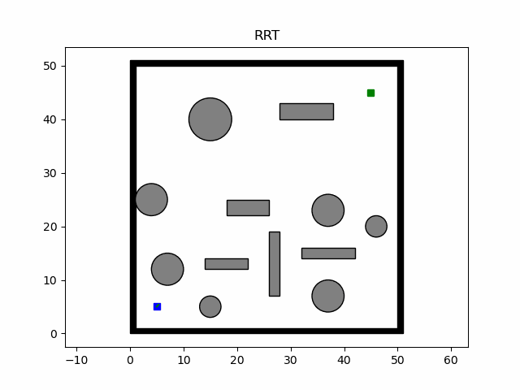

# 1. RRT

**考虑机器人运动学和障碍物约束的RRT**

对于RRT*等变种大同小异，无非是在节点选择等方面增加一些小trick，主要思路不变，这里不做复现。

# 2. Path-Smoothing with Bezier

#### 1.G1连续的贝塞尔曲线做普通的路径平滑

目前补了G1连续二次贝塞尔曲线平滑的小坑

#### 2.利用简化G2连续的贝塞尔曲线，最大曲率可人为设定的路径平滑

G2连续，三次贝塞尔曲线平滑中，通过一定简化可以平滑出具有给定曲率上限的曲线，但是对于两个路径点之间的长度和角度有一定的要求，这个坑下次一定

- Path-smoothing algorithm fits an ordered sequence of waypoints generated by the path planner.
- Based upon  parametric cubic Bezier curves
- Only requires the maximum curvature to be define

**参考文献：**

Rapidly-Exploring Random Trees: A New Tool for Path Planning

An Analytical Continuous-Curvature Path-Smoothing Algorithm

# 3. Path-Smoothing with clamped B-spline

- B样条是贝塞尔曲线的升级版
-  B-spline 平滑这里几乎贴着原来的路径了，是因为没有对控制点下采样，这里就不采样了，对于如何抛弃一些控制点，具体是有一定方法的
- B-spline 写起来感觉比较难，参考了大神写的内容，修改了一些，这里的demo是只有一条B样条的平滑，也可以考虑多条，做拼接

## 3.1 Path-Smoothing result

##### 注：Bezier平滑看起来不贴合原来的路径，是因为在Bezier函数部分写了下控制点下采样，只是均匀采的，而B-spline部分干脆就没写了，所以比较贴合。也就是说整体的控制点选择这一部分工作，代码中基本是没做的，之后有需要再补充。

# 4. Genetic algorithm

尝试用遗传算法做路径规划，借鉴一篇论文的思想瞎写了一下，主要思路如下：

规划demo如下：

**局限性**

- 当前版本是通过坐标编码，固定了x轴间隔，变化y轴来做变异，只能说很不智能，并且现在都只是二维的，三维的情况变异更加复杂
- 时间复杂度高，规划慢，类似的启发式算法还是适用于优化的场景
- 对于GA, PSO之类大差不差的启发式算法，对它们的态度是把它们看成一种工具，数学解析解永远是最优的。但是当解析解没法算或者你不会算的时候，可以利用这些工具去解决一些问题，给你提供一些解决的依据。

**参考文献：**

Optimal path planning and execution for mobile robots using genetic algorithm and adaptive fuzzy-logic control

